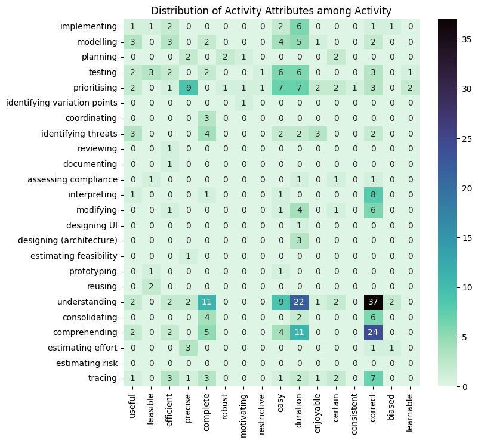
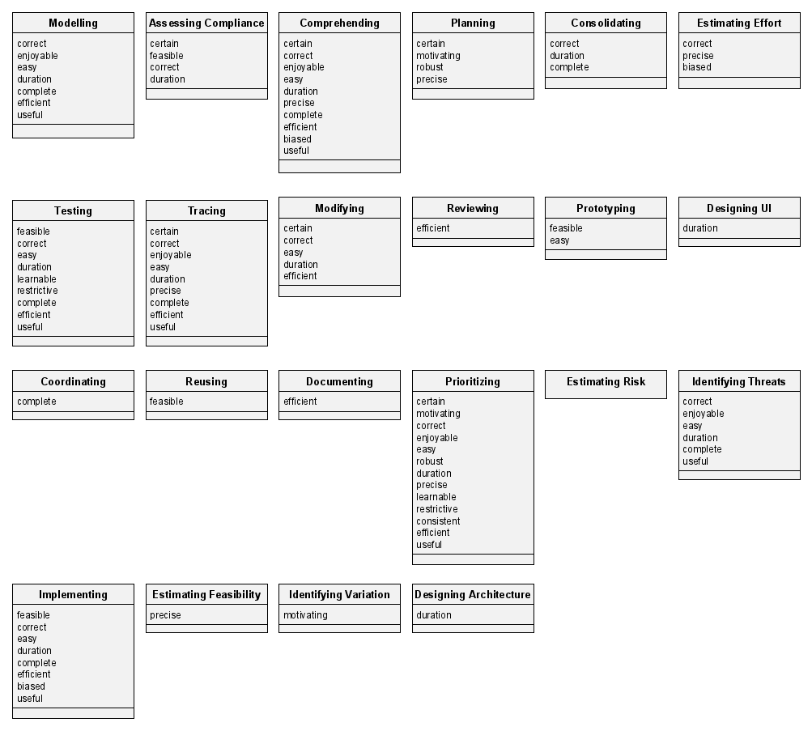
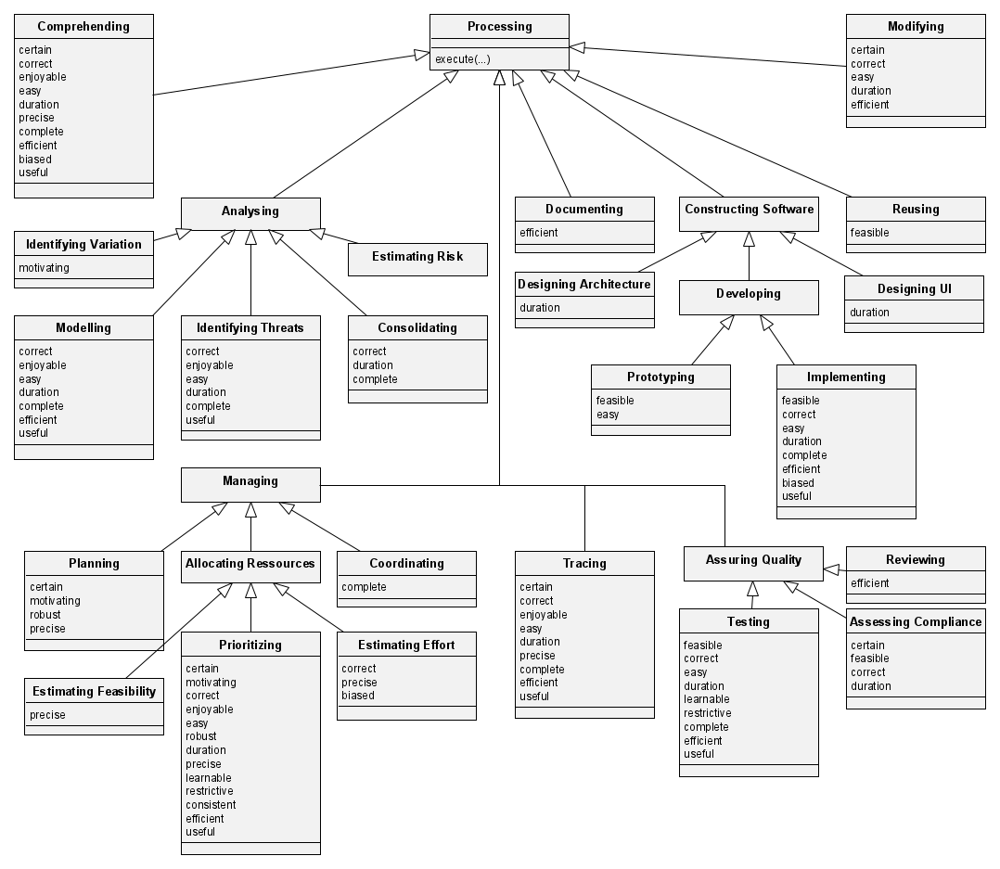
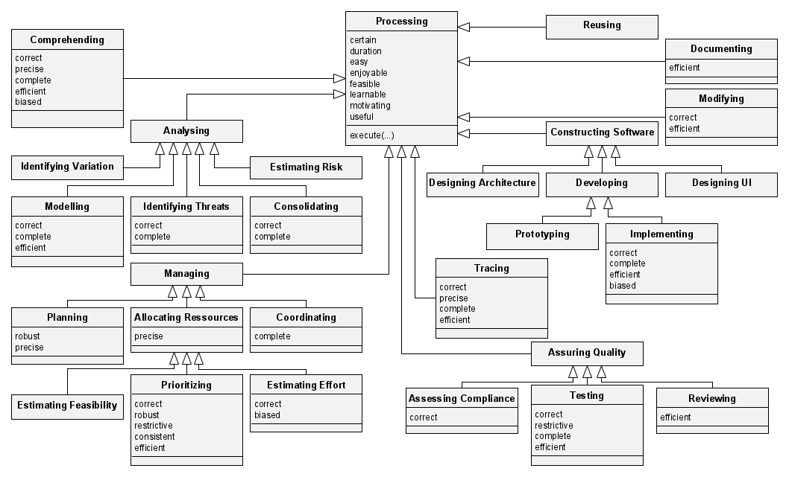

# Model construction

This document reports the process of constructing the model of requirements-affected activities and their attributes in the scope of the initial prototype study. The construction process consists of the following steps.

| # | Step | Purpose |
|---|---|---|
| 1 | [Creating classes](#creating-classes) | Population of the model with elements |
| 2 | [Creating a hierarchy](#creating-a-hierarchy) | Structuring the elements hierarchically | 
| 3 | [Abstracting attributes](#abstracting-attributes) | Moving attributes to higher levels |
| 4 | [Adding artifacts](#adding-artifacts) | Adding artifact concepts |

## Creating classes

The starting point of the model construction process is the [code consolidation](./../src/code-consolidation.ipynb) process, in which the codes applied to the extracted data were cleaned and organized. The code consolidation produced the following matrix of co-occurrence.

Each cell contains a number specifying how many data points were coded with this combination of the respective activity (in the rows) and activity attribute (in the columns). We create one class for each row, adding all attributes with a cell count of more than one as attributes tp the class. This results in the following overview.

We took the freedom to merge the *interpreting* and *understanding* with the *comprehending* activity because the surveyed literature does not contain any sufficient distinction of the three activities.

## Creating a hierarchy

To structure the model better, we introduce a hierarchy, i.e., order the classes in an inheritence tree structure where an activity inheriting from another hierarchy is seen as its sub-type while also - aligned with the class diagram notation - inherits its attributes. This process requires two subjective steps:

1. Introducing abstract activities (as classes) that did not appear in the list of codes
2. Connecting more specific with more abstract activities

Both steps were guided by the personal experience of the authors as well as the "Guide to the Software Engineering Body of Knowledge"[^1]. The resulting model looks as follows.

## Abstracting attributes

In principle, if all sub-classes of a super-class contain the same attribute, this attribute can be moved to the super-class. In our data set, there are candidates of attributes that are likely to be transferrable to super-classes, but they are not reported in combination with all activities. This is a shortcoming of the sample data, not the structure of the model. 

Consequently, we make subjective assumptions about the transferability of some attributes, i.e., identify "universally applicable" attributes and move them to the most abstract *processing* activity. The following attributes were deemed universal:

* useful
* feasible
* motivating
* easy
* duration
* enjoyable
* certain
* learnable

These attributes represent both the general temporal property (duration) and human properties (ease-of-use, ease-of-learning, etc.). The resulting, minimized model looks as follows.

## Adding Artifacts

A final extension to the model is adding the perspective of artifacts. As some activities are evaluated by the artifacts they produce, they form an important perspective when characterizing the fitness-for-purpose of a requirement. The top part of the following model contains the previously constructed, minimal model of activities and activity attributes, while the bottom part contains a model of produced artifacts and their artifact attributes. Every non-inheritance relation between an activity and an artifact means "*activity* produces *artifact*."

Because the artifact attributes resemble the ones of standard software product qualities,[^2] we chose to exclude it from the manuscript.

[^1]: Bourque, P., & Fairley, R. J. N. I. C. S. (2004). Swebok. Nd: IEEE Computer society.

[^2]: ISO/IEC 25010 (2011) Systems and software engineering: Systems and software Quality Requirements and Evaluation (SQuaRE) - System and software quality models. International Organization for Standardization, Geneva