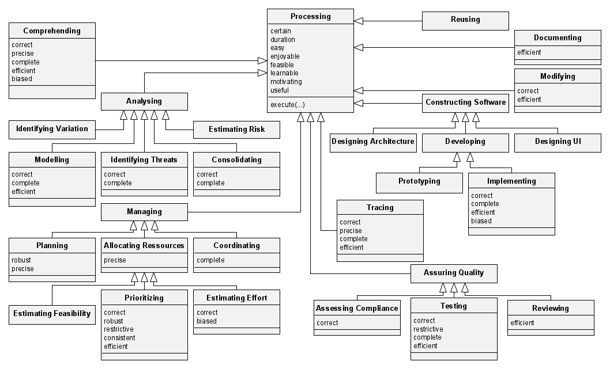

# Requirements-affected Activities and their Attributes

This repository contains the data, material, source code, and results of the initiative of creating and maintaining a harmonized model of requirements-affected activities and their attributes. 

Requirements fulfill a purpose of informing subsequent software engineering activities that are affected by them, i.e., that use these requirements as an input. The figure below visualizes a simplified software development process and highlights activities that count as *requirements-affected* since they use a requirements specification as an input.

Given a lack of a systematic overview of requirements-affected activities and their attributes, by which they can be measured, we initiate the construction of such a model in our initial study. The first version of the model looks as follows.

Find a detailed description of the content of this repository in the [description of the artifact](#description-of-the-artifact), including where to find which file. The [system requirements](#system-requirements) and [installation instructions](#installation-instructions) provide guidance for using the content of this repository. And view the [steps to replicate](#steps-to-replicate) in order to find quick access guidelines when trying to replicate specific parts of the study.

## Description of the Artifact

### Overview

This artifact is structured according to the steps of the study during which it was created. The repository consists of the following directories and files.

* 1-data-collection: directory containing all instructions and data from the three data collection procedures
  * experimentation-literature: material for the systematic literature review of human-subject experiments in requirements engineering
    * primary-study-candidates: directory containing one table of primary studies when executing the search string for each eligible venue (conference/journal)
    * r3a-slr-experimentation.xlsx: Excel file containing all primary studies and the verdict about inclusion/exclusion
    * r3a-venues.xlsx: Excel file listing all software engineering venues that were considered for the literature review
    * review-guidelines.pdf: instructions about the **data base search** as well as the **inclusion/exclusion** (i.e., inclusion and exclusion criteria) of primary studies
    * validity_inclusion.ipynb: calculation of the inter-rater agreement between two researchers on the inclusion/exclusion phase
  * interview-study: material for the interview study about requirements quality
    * interview-protocol.pdf: guideliens for the execution of the semi-structured interview about requirements quality impact
    * visual-aid.pdf: visual support (i.e., slide deck) for the interview
  * process-model-literature: material for the review of software process liteature
    * r3a-process-models.xlsx: Excel file specifying the reviewed software process models
* 2-data-coding: directory containing all instructions, data, and evaluation of the coding process of the extracted data
  * data-evaluation.ipynb: notebook generating descriptive statistics about the coded data
  * meta-model-coding-guidelines.pdf: meta-model of the extracted concepts as well as **coding guidelines** for the coding of the extracted textual descriptions
  * r3a-data-extraction.xlsx: Excel file containing the extracted and coded data
  * validity_evaluation.ipynb: calculation of the inter-rater agreement between two researchers on the exclusion of non-valuating attributes
* 3-model-construction: directory containing all material for the construction of the model from the coded data
  * models: figures of the different versions of the model (both in editable `.graphml` format, as a `.pdf` vector graphic, and `.png` pixel graphic)
  * code-consolidation.ipynb: notebook consolidating model properties from the extracted codes (e.g., visualizing distributions and co-occurrences)
  * model-consolidation.md: markdown file describing the **model construction** process from the codes to the model (including a documentation of all subjective decisions)
* supplementary: additional material
  * figures: additional figures for visualization of results
  * util: utility source code files
* requirements.txt: list of required Python libraries to execute the source code files

### Table Details

The following contains more information about certain, more complex tables.

## System Requirements

The following requirements must be met in order to utilize the artifacts contained in this repository:

* To utilize **the data**, you need a spreadsheet software like [Microsoft Excel](https://www.microsoft.com/de-de/microsoft-365/excel) to open the .xlsx file.
* To exectute **the code**, [Python 3.10](https://www.python.org/downloads/release/python-3100/) must be available and an editor software like [Visual Studio Code](https://code.visualstudio.com/download) is recommended.
* To edit **the figures**, you require an editor capable of opening Graph Markup Language (`.graphml`) files, for example the [yEd Graph Editor](https://www.yworks.com/products/yed).

However, all figures are also provided in vector graphic (`.pdf`) and pixel graphic (`.png`) format for an easier viewing experience independent of a graph editor.

## Installation Instructions

To execute the code contained in this repository, make sure all requirements contained in the [requirements.txt](./requirements.txt) are installed by executing `pip install -r requirements.txt`. To avoid conflicts with the local Python environment, create a separate [virtual environment](https://docs.python.org/3/library/venv.html):

1. Create a virtual environment with `python -m venv .venv`
2. Activate the virtual environment with `./venv/Scripts/activate`
3. Install the requirements as described above.
4. Install the ipykernel either by selecting the virtual environment `.venv` as the runtime environment for the Jupyter notebook in VS Code (which will trigger VS Code to automatically install the ipykernel) or [install it manually](https://github.com/ipython/ipykernel).

Once the virtual environment is running and all requirements installed and ipykernel are installed, the Jupyter notebook can be executed from the virtual environment.

## Steps to Replicate

The following subsections highlight how to use the artifacts in this repository in order to comprehend the steps of the study.

### Systematic Literature Review on Requirements Experimentation

In order to understand the SLR on human-subject experimentation involving requirements specifications, conduct the following steps:

1. Review the [SLR guidelines](./1-data-collection/experimentation-literature/review-guideline.pdf), which describe the overall approach of this review.
2. Inspect the [list of venues](./1-data-collection/experimentation-literature/r3a-venues.xlsx). The sheets "Conferences" and "Journals" contain all Software Engineering (SE) venues with a [CORE rank](portal.core.edu.au/conf-ranks) of A* or A (plus a few select additions relevant to requirements engineering). Both sheets contain a classification of whether they are actually relevant to SE or not.
3. Inspect the [selection of venues](./1-data-collection/experimentation-literature/r3a-venues.xlsx), i.e., the sheet named "Selection", for a summary of all SE relevant venues plus their search term for the respective library where the venue is reliably indexed.
4. Review the articles returned by the database searches. Each file in the [candidates directory](./1-data-collection/experimentation-literature/primary-study-candidates/) contains the search results for one respective venue (identifiable by the acronym contained in the file title).
5. Inspect the [inclusion table](./1-data-collection/experimentation-literature/r3a-slr-experimentation.xlsx):
    1. The sheet "Candidates" assembles the search results of all files from the candidates directory. It further contains the rating of the inclusion and exclusion criteria (I1, I2, E1-E4).
    2. The sheet "Venues" shows an overview over all venues. The column "IP" calculates the inclusion percentage, i.e., how many of the candidates from the database search of this venue (total number in column "N") were included.
    3. The sheets "Overlap" and "Overlap 2" show the independent execution of the inclusion criteria to a random sample of studies. 
    4. The sheets "Agreement" and "Agreement 2" contrast the decision of the two raters and show disagreements.
6. Execute the [validity notebook](./1-data-collection/experimentation-literature/validity_inclusion.ipynb) to recalculate the interrater agreement between two raters (Overlap 2).

## Author and Article information

(anonymized during the double-blind peer review process)

## Licensing

Copyright © 2024 by the authors. This work is licensed under [MIT License](./LICENSE).