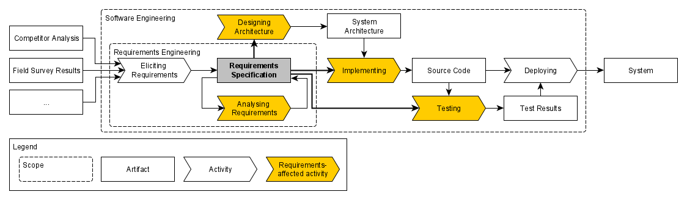

# Requirements-affected Activities and their Attributes

This repository contains the data, material, source code, and results of the initiative of creating and maintaining a harmonized model of requirements-affected activities and their attributes. 

Requirements fulfill a purpose of informing subsequent software engineering activities that are affected by them, i.e., that use these requirements as an input. The figure below visualizes a simplified software development process and highlights activities that count as *requirements-affected* since they use a requirements specification as an input.

## Description of the Artifact

### Overview

This artifact is structured according to the steps of the study during which it was created. The repository consists of the following directories and files.

* 1-data-collection: directory containing all instructions and data from the three data collection procedures
  * experimentation-literature: material for the systematic literature review of human-subject experiments in requirements engineering
    * primary-study-candidates: directory containing one table of primary studies when executing the search string for each eligible venue (conference/journal)
    * r3a-slr-experimentation.xlsx: Excel file containing all primary studies and the verdict about inclusion/exclusion
    * r3a-venues.xlsx: Excel file listing all software engineering venues that were considered for the literature review
    * review-guidelines.pdf: instructions about the **data base search** as well as the **inclusion/exclusion** (i.e., inclusion and exclusion criteria) of primary studies
    * validity_inclusion.ipynb: calculation of the inter-rater agreement between two researchers on the inclusion/exclusion phase
  * interview-study: material for the interview study about requirements quality
    * interview-protocol.pdf: guideliens for the execution of the semi-structured interview about requirements quality impact
    * visual-aid.pdf: visual support (i.e., slide deck) for the interview
  * process-model-literature: material for the review of software process liteature
    * r3a-process-models.xlsx: Excel file specifying the reviewed software process models
    

## System Reqirements

## Usage Instructions

## Author and Article information

(anonymized during the double-blind peer review process)

## Licensing

Copyright © 2023 by the authors. This work is licensed under [MIT License](./LICENSE).