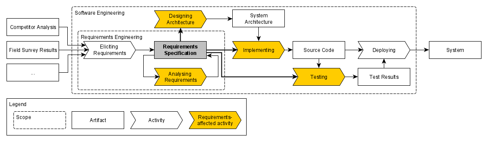

# Requirements-affected Activities and their Attributes

This repository contains the data, material, source code, and results of the initiative of creating and maintaining a harmonized model of requirements-affected activities and their attributes. 

Requirements fulfill a purpose of informing subsequent software engineering activities that are affected by them, i.e., that use these requirements as an input. The figure below visualizes a simplified software development process and highlights activities that count as *requirements-affected* since they use a requirements specification as an input.

## Description of the Artifact

## System Reqirements

## Usage Instructions

## Author and Article information

(anonymized during the double-blind peer review process)

## Licensing

Copyright © 2023 by the authors. This work is licensed under [MIT License](./LICENSE).